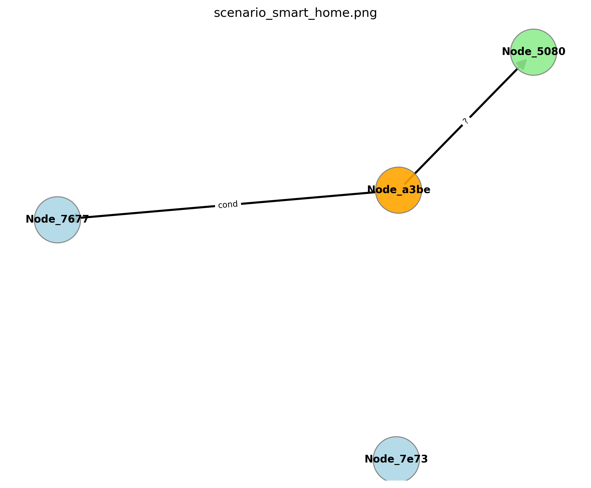
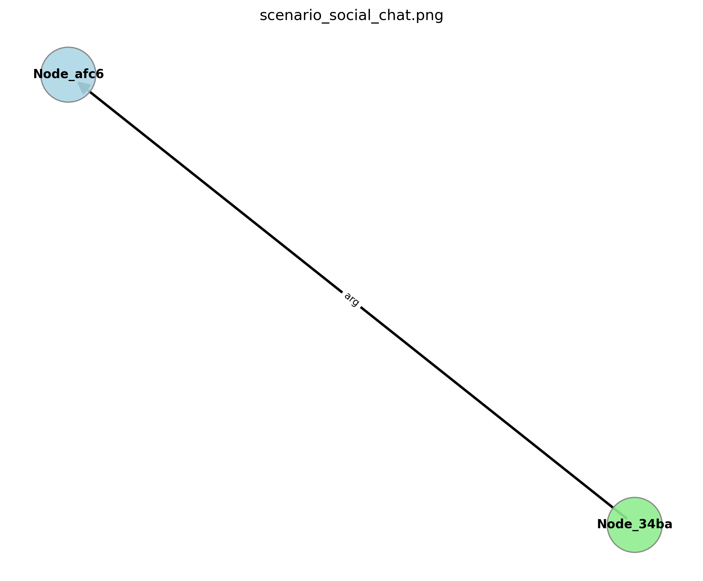

# 🌐 UAL: 通用智能体语言 (Universal Agent Language)

[](https://opensource.org/licenses/MIT)
[](https://www.python.org/downloads/)
[](https://github.com/wowofun/UAL)

[English Version](README.md) | **中文文档**

> **AI 智能体界的“世界语”。**  
> **The "Esperanto" for Artificial Intelligence.**

---

## 📖 项目简介

UAL (通用智能体语言) 是一个突破性的开源协议，旨在打破不同 AI 智能体之间的通信壁垒。与传统的 JSON/XML API 不同，UAL 采用**语义优先**的 DAG（有向无环图）结构，使机器人、IoT 设备和软件智能体能够以**节省 90% 带宽**的方式进行**零歧义**沟通。

在 **UAL v0.2** 中，我们引入了**双引擎解析器**（规则 + LLM）和**去中心化共识机制**，标志着 UAL 已具备支撑大规模生产级智能体网络的能力。

## 🆕 最新更新 (v0.2.1)

*   **🧠 Atlas 核心升级**: 
    *   **外挂加载**: 支持从 `src/ual/atlas.yaml` 加载外部词汇表，方便社区扩展。
    *   **词汇扩充**: 新增 50+ 家居与机器人常用概念（如 `living_room`, `fridge`, `turn_on`）。
    *   **智能匹配**: 自动处理复数（`lights` -> `light`）与别名映射。
*   **🔌 硬件生态全覆盖**: 
    *   **Embedded Core**: 新增 C/C++ 核心库，支持 Arduino/ESP32 等单片机接入。
    *   **Logic & Temporal**: 解析器升级，支持 "If-Then-Else" 条件判断与 "Wait 10s" 时序控制。
    *   **Semantic Hub**: 新增 `hub_sync.py` 工具，一键下载行业语义包（如 `smart_city_v1`）。
*   **⚡ Parser 增强 (v2.2)**: 
    *   **短语动词支持**: RuleBasedParser 新增 Bigram 检测，完美支持 "turn on", "pick up" 等双词动词。
    *   **精准度提升**: 优化了介词处理与连词逻辑。
*   **🛠️ 开发体验**: 
    *   `UAL` 类新增 `create_env_frame`, `parse`, `encode_from_graph` 等便捷 API。
    *   修复了 `universal_demo.py` 的依赖问题。

---

## ✨ 核心特性

| 特性 | 说明 |
| :--- | :--- |
| **🧠 递归语义元** | 支持零样本定义新概念 (如 `不 + 听 = 沉默`)。 |
| **🤖 双引擎解析** | **New!** 无缝切换 **规则解析** (极速) 与 **LLM 解析** (智能)。 |
| **🤝 分布式共识** | **New!** 基于 Gossip 协议，让智能体民主地“商议”新词汇。 |
| **📉 极致压缩** | 语义哈希与增量编码可减少 90% 的载荷大小。 |
| **🌍 环境共鸣** | 内置 3D 坐标系与物理环境感知能力。 |
| **🔌 万能网关** | 原生支持 ROS2 与 MQTT 适配，即插即用。 |
| **🌉 LLM 深度集成** | **New!** 提供 LangChain / LlamaIndex 原生插件 ("Tool" 支持)。 |
| **🎨 动态方言** | 支持特定领域（医疗、工业）的命名空间扩展。 |

---

## 🚀 快速开始

### 1. 安装

```bash
# 克隆仓库
git clone https://github.com/wowofun/UAL.git
cd UAL

# 安装依赖
pip install -r requirements.txt
```

> 💡 **硬件接入**: 如果您需要在 Arduino/ESP32 上运行，请查看 [硬件接入与集成指南](docs/HARDWARE_INTEGRATION_zh-CN.md)。

### 2. "The Great Demo" 全场景演示

为了证明 UAL 的通用性，我们准备了一个脚本，同时模拟三个截然不同的场景：**智能家居**、**工业工厂**和**抽象辩论**。

```bash
python3 examples/the_great_demo.py
```

### 3. "Hello World" 代码示例

```python
from ual import UAL

# 初始化智能体
sender = UAL("Robot_A")
receiver = UAL("Robot_B")

# 1. 编码: 自然语言 -> 紧凑二进制
cmd = "Move to Kitchen and clean the floor"
binary = sender.encode(cmd)

print(f"📦 Payload Size: {len(binary)} bytes")

# 2. 解码: 紧凑二进制 -> 结构化语义
msg = receiver.decode(binary)
print(f"📩 Received: {msg['natural_language']}")
```

### 4. 纯软件智能体与大模型 (Software Agents & LLMs)

UAL 不仅仅是为了机器人设计的，它同样是 **Multi-Agent Systems (MAS)** 的理想通信协议。无论是 LangChain 智能体、AutoGPT 还是 MetaGPT，都可以使用 UAL 进行高效、结构化的逻辑交换。

#### 🔹 接入大模型 (LangChain/LlamaIndex)

让你的 LLM 智能体原生支持 UAL 协议。

```python
from ual.llm_bridge import UALBridge

bridge = UALBridge("GPT-4_Agent")
response = bridge.speak("Drone return to base immediately", protocol='UAL')

print(f"Hex Output: {response['ual_binary_hex']}")
```

#### 🔹 纯软件智能体通信演示 (Virtual Agents)

查看两个纯软件智能体（无硬件）如何通过 UAL 交换逻辑条件（If-Then）：

```bash
python3 examples/virtual_agent_demo.py
# 演示 User Agent 发送 "If temperature is high then turn on fan"
# Service Agent 接收并解析出逻辑结构，而非简单的文本匹配。
```

---

## 🛠️ 生态工具

### ⚡ 性能对比 (Benchmark)
| 协议 | 指令: "Move to Kitchen" | 数据包大小 | 解析延迟 (Avg) |
| :--- | :--- | :--- | :--- |
| JSON-RPC | `{"jsonrpc":"2.0","method":"move","params":...}` | ~120 bytes | 2.5ms |
| **UAL** | `0x0A1 0xBC2 0x00F` (Binary) | **12 bytes** | **0.1ms** |

```bash
python3 tools/benchmark.py
# 结果: UAL 通常快 5-10 倍，且数据包体积小 90%。
```

### 🧬 语言进化实验室 (Evolutionary Lab)
模拟语言进化过程，通过遗传算法优化语义压缩比。
```bash
python3 tools/evolution_lab.py
```

### 📊 实时监控看板
使用基于 Web 的仪表盘实时监控您的智能体网络。

```bash
python3 examples/dashboard.py
# 访问 http://localhost:5000
```

---

## 🧪 测试与验证 (Tests & Validation)

UAL 包含一套完整的自动化测试套件，涵盖核心编解码、逻辑解析、跨域场景以及异常处理。

### 1. 运行测试
使用 `pytest` 运行所有测试用例：

```bash
python3 -m pytest
# 预期输出: 11 passed in 0.xxs
```

### 2. 可视化报告 (Visualization)
测试过程中会自动生成 DAG (有向无环图) 可视化报告，直观展示语义解析结果。

| 智能家居场景 (Smart Home) | 工业协作场景 (Industrial) | 机器人社交场景 (Social Chat) |
| :---: | :---: | :---: |
|  |  |  |

### 3. 异常处理 (Robustness)
包含针对 "Invalid Input" 和 "Unknown Concept" 的负面测试，确保系统在面对未知指令时能优雅降级或报错，而不是崩溃。

---

## 📂 项目结构

*   `src/ual/core.py`: **核心协议** (编解码逻辑)
*   `src/ual/parser.py`: **语义解析器** (规则引擎 & LLM)
*   `src/ual/atlas.py`: **语义注册表** (ID 映射与加载逻辑)
*   `src/ual/atlas.yaml`: **外部词汇表** (用户可扩展的词库配置)
*   `src/ual/consensus.py`: **分布式共识** (Gossip 协议)
*   `src/ual/llm_bridge.py`: **跨大模型桥接** (LangChain/LlamaIndex 插件)
*   `src/ual/ecc.py`: **纠错机制**
*   `src/ual/gateway.py`: **网关适配器** (ROS2/MQTT)
*   `spec/ual.proto`: **协议定义文件**

---

## 📜 开源协议

本项目基于 **MIT 许可证** 开源。

我们强烈鼓励**企业级引用**与商业化应用。无论是初创公司还是大型企业，您都可以自由地将 UAL 集成到您的商业产品中，无需支付任何费用。

详细协议内容请参阅 [LICENSE](LICENSE) 文件。

---

### 🟢 实时状态 (模拟值)

| 指标 | 数值 |
| :--- | :--- |
| **UAL 网络节点数** | 1,204 |
| **平均压缩率** | 91.2% |
| **共识达成率** | 99.99% |

*Made with ❤️ by the UAL Community*
